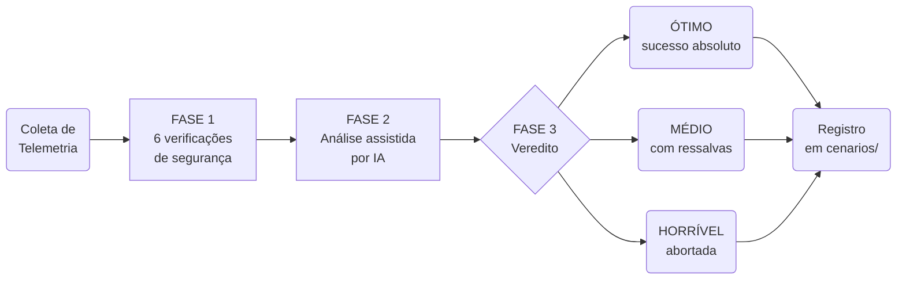
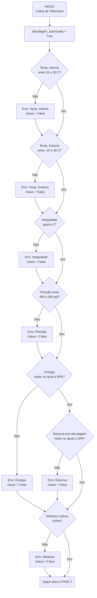
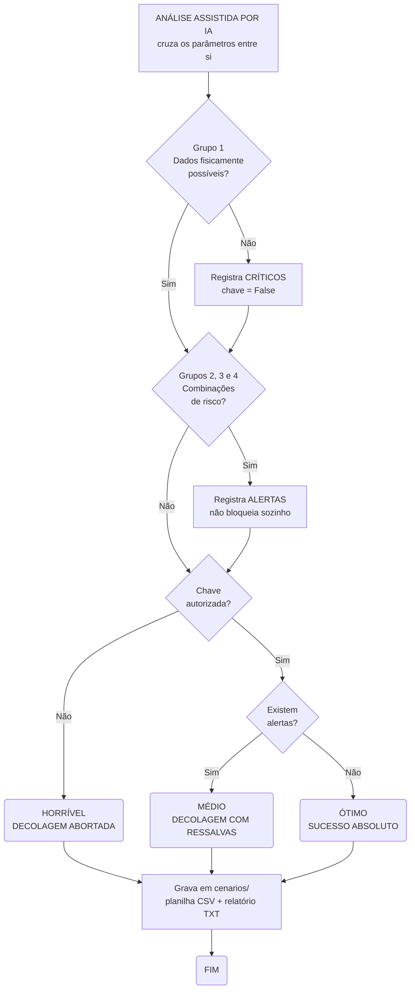

# Projeto em Grupo - FIAP
Introdução
1.1 Organização e descrição da telemetria

Interpretar dados referentes a:

Temperatura interna e externa;
Integridade estrutural (0/1);
Níveis de energia (%);
Pressão dos tanques;
Status dos módulos críticos.

1.2 Algoritmo de verificação

Construir um algoritmo (fluxograma/pseudocódigo) capaz de decidir: “PRONTO PARA DECOLAR” ou “DECOLAGEM ABORTADA” com base em faixas seguras predefinidas.

1.3 Script em Python

Implementar a lógica do algoritmo em Python, simulando:

Leitura dos dados;
Execução das verificações;
Resultado final impresso.

1.4 Análise energética

Calcular autonomia inicial considerando:

Capacidade total (kwh); 1000 - 80% - 800 - 500
Carga atual (%);
Consumo estimado na decolagem; - 300kwh
Perdas energéticas. - 

1.5 Análise assistida por IA - implementar uma IA que analise os resultados informados pelo usuario a fim de identificar 
discrepancias nos dados informados.

Solicitar à IA: 

Classificação dos dados;
Identificação de possíveis anomalias;
Sugestões de risco.


1.6 Reflexão crítica

Texto sobre: 

Ética e responsabilidade;
Impacto social da exploração espacial;
Sustentabilidade tecnológica.

Em relação aos entregáveis, é necessário:

Um relatório em PDF contendo todos os dados pedidos na atividade integradora (códigos, análises, algoritmos etc.);
Link do repositório público no GitHub contendo:
Notebook Python (.ipynb);
Arquivo README.md contendo:
Explicação do projeto;
Prints da execução;
Instruções de execução do código.

3 Critérios de avaliação (10 pontos totais)


------------------------------------------------------------------------

ALGORITMO DE VERIFICAÇÃO

Minha sugestão de tabela para a gente validar:

| Parâmetro | Valor Nominal (Ideal) | Margem de Tolerância / Limite | Condição de Aborto |
| :--- | :--- | :--- | :--- |
| Temp. Interna | 22°C | 15°C a 30°C | < 15°C ou > 30°C |
| Temp. Externa | 25°C | -10°C a 45°C | < -10°C ou > 45°C |
| Integridade | 1 (OK) | Apenas 1 | = 0 |
| Energia | 100% | Mínimo 80% | < 80\% |
| Pressão Tanques | 500 psi | 450 psi a 550 psi | < 450 ou > 550 |
| Módulos Críticos | Online | Todos Online | Qualquer módulo Offline |

Por que esses valores?
- Temperatura: Mantém a eletrônica em range industrial padrão.
- Energia: Garante que não falte carga no pico da decolagem.
- Pressão: Define um range de ± 10\% do nominal, que é comum em sistemas hidráulicos/pneumáticos.

ALGORITMO EM PSEUDOCÓDIGO

Uma observação importante sobre o desenho: as verificações **não abortam em
cascata**. Todas as seis são executadas sempre, e cada uma pode desligar a chave
`decolagem_autorizada`. Isso é proposital — em telemetria, o operador precisa ver
todos os problemas de uma vez, e não descobrir o próximo defeito só na tentativa
seguinte.

Início: Verificação de Decolagem

FASE 1 — VERIFICAÇÕES DE SEGURANÇA (todas executam, acumulando erros)
1. Temperatura Interna entre 15°C e 30°C?      Não → registra erro, chave = False
2. Temperatura Externa entre -10°C e 45°C?     Não → registra erro, chave = False
3. Integridade Estrutural igual a 1?           Não → registra erro, chave = False
4. Pressão dos Tanques entre 450 e 550 psi?    Não → registra erro, chave = False
5. Energia ≥ 80\%?                              Não → registra erro, chave = False
   5a. Se passou: reserva pós-decolagem ≥ 10\%? Não → registra erro, chave = False
6. Módulos Críticos todos online?              Não → registra erro, chave = False

FASE 2 — ANÁLISE ASSISTIDA POR IA (cruzamento entre os parâmetros)
7. Grupo 1 — Os dados são fisicamente possíveis?
   - Não → registra DISCREPÂNCIA CRÍTICA e desliga a chave.
8. Grupos 2, 3 e 4 — Existem combinações de risco entre parâmetros válidos?
   - Sim → registra ALERTA (não bloqueia por si só).

FASE 3 — VEREDITO E CLASSIFICAÇÃO
9. Chave desligada?          → HORRÍVEL  → DECOLAGEM ABORTADA
10. Chave ligada com alertas → MÉDIO     → DECOLAGEM COM RESSALVAS
11. Chave ligada sem alertas → ÓTIMO     → SUCESSO ABSOLUTO

Fim: registro do cenário em `cenarios/` (planilha CSV + relatório TXT)

FLUXOGRAMA — VISÃO GERAL



FLUXOGRAMA — FASE 1: VERIFICAÇÕES DE SEGURANÇA



FLUXOGRAMA — FASES 2 E 3: ANÁLISE POR IA E VEREDITO



CENÁRIOS POSSÍVEIS

O ponto central do novo fluxo é que **autorizar não é o mesmo que estar tudo
bem**. A camada de IA separa o "decolou porque nada impediu" do "decolou sem
nenhuma ressalva", que o veredito binário anterior não distinguia.

| Classificação | Chave | Alertas | Significado | Exemplo real coletado |
| :--- | :--- | :--- | :--- | :--- |
| **ÓTIMO** | Autorizada | Nenhum | Sucesso absoluto: nenhuma discrepância no cruzamento dos dados | Cenário 09 — noite fresca, bateria a 98% |
| **MÉDIO** | Autorizada | 1 ou mais | Decolagem viável, mas consumindo margem de segurança. Recomenda revisão humana | Cenário 06 — cabine a 29°C, externa a -8°C, tanque a 535 psi (3 alertas) |
| **HORRÍVEL** | Abortada | — | Falha em verificação de segurança **ou** telemetria não confiável | Cenário 08 — energia lida como 105% e integridade como 3 |

O caso mais instrutivo é o **cenário 08**: as seis verificações clássicas
aprovaram todos os parâmetros (105 não é menor que 80; 3 não é menor que 1), e
foi a Fase 2 que barrou a decolagem ao perceber que os valores eram fisicamente
impossíveis. É exatamente a lacuna que motivou incluir a IA no fluxo.

Como funciona
<pre> ```mermaid graph TD A[Início] --> B{Energia ≥ 80%?} B -- Não --> C[ABORTAR] B -- Sim --> D[DECOLAR] ``` </pre>
Três peças e só:

Peça	Sintaxe	Vira
Direção	graph TD / graph LR	de cima p/ baixo · da esquerda p/ direita
Caixa retangular	A[Texto]	processo / ação
Losango	B{Texto?}	decisão
Balão	C(Texto)	início / fim
Seta	A --> B	fluxo
Seta com rótulo	B -- Não --> C	saída de decisão
O A, B, C são só apelidos internos — não aparecem no desenho. Servem para você ligar as caixas. Por isso C --> E mais adiante reaproveita a caixa C já declarada, sem repetir o texto.

Onde isso aparece renderizado
GitHub — renderiza nativo. Como o entregável é repositório público, o fluxograma vai aparecer desenhado direto no .md. ✅
Obsidian — renderiza nativo.
VS Code — o preview embutido não renderiza; precisa da extensão Markdown Preview Mermaid Support. É bem provável que seja por isso que você achou que não estava funcionando.

