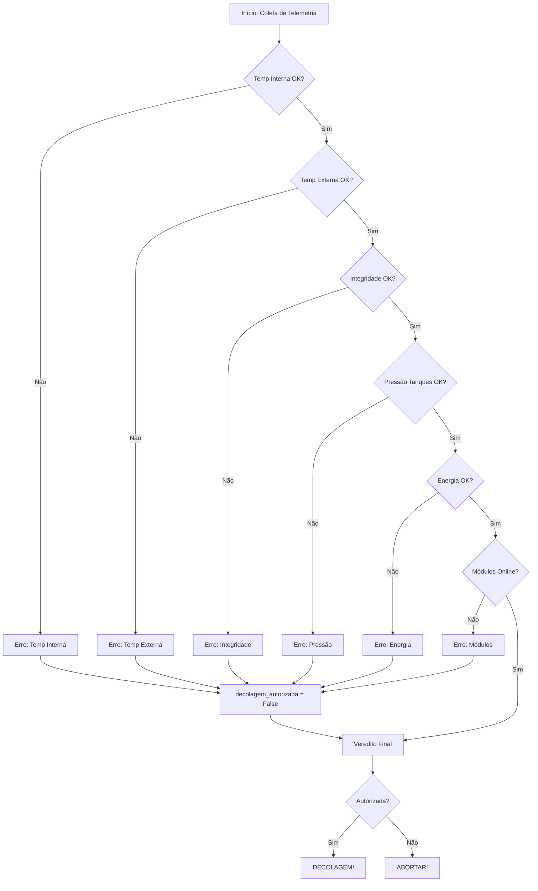

# Projeto em Grupo - FIAP
Introdução
1.1 Organização e descrição da telemetria

Interpretar dados referentes a:

Temperatura interna e externa;
Integridade estrutural (0/1);
Níveis de energia (%);
Pressão dos tanques;
Status dos módulos críticos.

1.2 Algoritmo de verificação

Construir um algoritmo (fluxograma/pseudocódigo) capaz de decidir: “PRONTO PARA DECOLAR” ou “DECOLAGEM ABORTADA” com base em faixas seguras predefinidas.

1.3 Script em Python

Implementar a lógica do algoritmo em Python, simulando:

Leitura dos dados;
Execução das verificações;
Resultado final impresso.

1.4 Análise energética

Calcular autonomia inicial considerando:

Capacidade total (kwh); 1000 - 80% - 800 - 500
Carga atual (%);
Consumo estimado na decolagem; - 300kwh
Perdas energéticas. - 

1.5 Análise assistida por IA - implementar uma IA que analise os resultados informados pelo usuario a fim de identificar 
discrepancias nos dados informados.

Solicitar à IA: 

Classificação dos dados;
Identificação de possíveis anomalias;
Sugestões de risco.


1.6 Reflexão crítica

Texto sobre: 

Ética e responsabilidade;
Impacto social da exploração espacial;
Sustentabilidade tecnológica.

Em relação aos entregáveis, é necessário:

Um relatório em PDF contendo todos os dados pedidos na atividade integradora (códigos, análises, algoritmos etc.);
Link do repositório público no GitHub contendo:
Notebook Python (.ipynb);
Arquivo README.md contendo:
Explicação do projeto;
Prints da execução;
Instruções de execução do código.

3 Critérios de avaliação (10 pontos totais)


------------------------------------------------------------------------

ALGORITMO DE VERIFICAÇÃO

Minha sugestão de tabela para a gente validar:

| Parâmetro | Valor Nominal (Ideal) | Margem de Tolerância / Limite | Condição de Aborto |
| :--- | :--- | :--- | :--- |
| Temp. Interna | 22°C | 15°C a 30°C | < 15°C ou > 30°C |
| Temp. Externa | 25°C | -10°C a 45°C | < -10°C ou > 45°C |
| Integridade | 1 (OK) | Apenas 1 | = 0 |
| Energia | 100% | Mínimo 80% | < 80\% |
| Pressão Tanques | 500 psi | 450 psi a 550 psi | < 450 ou > 550 |
| Módulos Críticos | Online | Todos Online | Qualquer módulo Offline |

Por que esses valores?
- Temperatura: Mantém a eletrônica em range industrial padrão.
- Energia: Garante que não falte carga no pico da decolagem.
- Pressão: Define um range de ± 10\% do nominal, que é comum em sistemas hidráulicos/pneumáticos.

FLUXOGRAMA

Início: Verificação de Decolagem
1. Bloco de Decisão 1: Integridade Estrutural
   - É igual a 1? 
     - Não → [ABORTAR] → Motivo: Falha Estrutural.
     - Sim → Próximo passo.

2. Bloco de Decisão 2: Módulos Críticos
   - Todos estão Online?
     - Não → [ABORTAR] → Motivo: Falha de Sistema Crítico.
     - Sim → Próximo passo.

3. Bloco de Decisão 3: Energia
   - Nível ≥ 80\%?
     - Não → [ABORTAR] → Motivo: Energia Insuficiente.
     - Sim → Próximo passo.

4. Bloco de Decisão 4: Pressão dos Tanques
   - Está entre 450 psi e 550 psi?
     - Não → [ABORTAR] → Motivo: Pressão Fora do Range.
     - Sim → Próximo passo.

5. Bloco de Decisão 5: Temperaturas (Interna e Externa)
   - Interna (15°C a 30°C) E Externa (-10°C a 45°C)?
     - Não → [ABORTAR] → Motivo: Temperatura Instável.
     - Sim → Próximo passo.

     Fim: [PRONTO PARA DECOLAR]

FLUXOGRAMA



Como funciona
<pre> ```mermaid graph TD A[Início] --> B{Energia ≥ 80%?} B -- Não --> C[ABORTAR] B -- Sim --> D[DECOLAR] ``` </pre>
Três peças e só:

Peça	Sintaxe	Vira
Direção	graph TD / graph LR	de cima p/ baixo · da esquerda p/ direita
Caixa retangular	A[Texto]	processo / ação
Losango	B{Texto?}	decisão
Balão	C(Texto)	início / fim
Seta	A --> B	fluxo
Seta com rótulo	B -- Não --> C	saída de decisão
O A, B, C são só apelidos internos — não aparecem no desenho. Servem para você ligar as caixas. Por isso C --> E mais adiante reaproveita a caixa C já declarada, sem repetir o texto.

Onde isso aparece renderizado
GitHub — renderiza nativo. Como o entregável é repositório público, o fluxograma vai aparecer desenhado direto no .md. ✅
Obsidian — renderiza nativo.
VS Code — o preview embutido não renderiza; precisa da extensão Markdown Preview Mermaid Support. É bem provável que seja por isso que você achou que não estava funcionando.